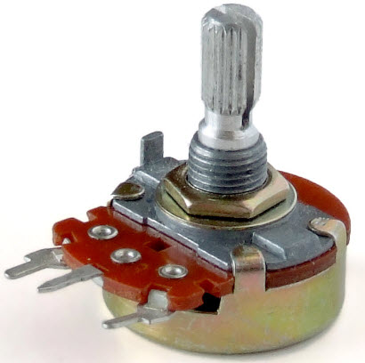

## Fast PWM controlling by ADC on ATmega16 

Hardware fast PWM + ADC in ATmega16. The same [task](https://github.com/rcv911/Fast-PWM-AVR) but now we should use ADC for change duty cycle.
  
>I recommend use variable resistor with led for check

## Motivation

Basic structure of fast PWM mode controlling by ADC in ATmega16 for begginers. Don't forget to use datasheet!

## Installation

0. You can use another MCUs. All you need is datasheet. Don't forget change pins!  
1. Make project in AVR Studio choosing 8-bit MCU ATmega16.  
2. Copy code from `pwm_adc.c` into your `main.c` file.
3. Build project.

## License

Free